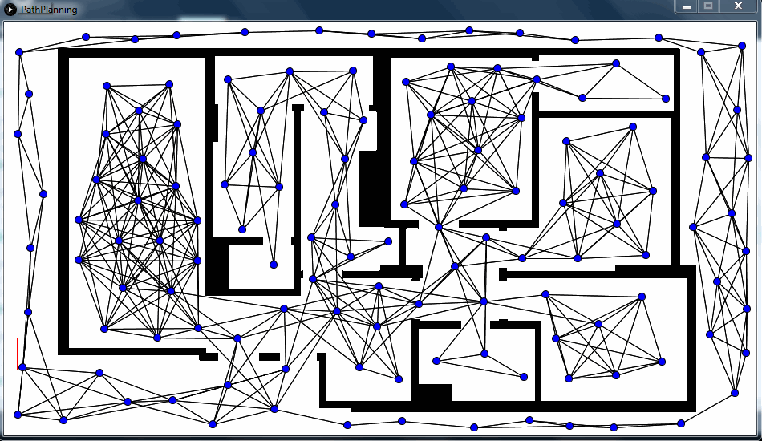
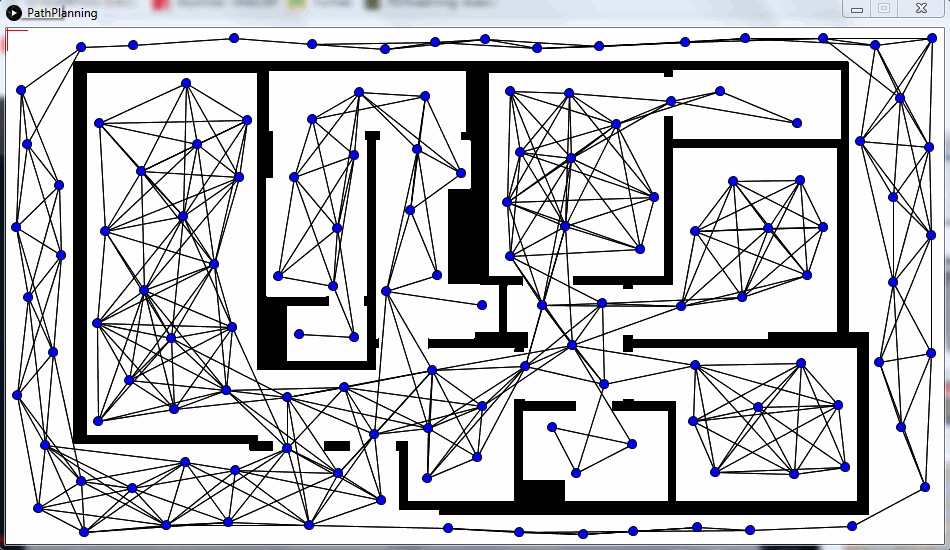

# Probabilistic-Roadmap
Algoritmo que resolve o problema de determinar um caminho entre uma configuração inicial e uma configuração de meta, evitando colisões. 
A ideia básica por trás do PRM é pegar amostras aleatórias do espaço, testando-as se estão no espaço livre e usar um planejador local para tentar conectar essas configurações a outras configurações próximas. As configurações iniciais e de meta são adicionadas e um algoritmo de busca é aplicado ao grafo resultante para determinar um caminho entre as configurações inicial e meta. (Fonte: _Wikipedia_)

A classe `PRM` gera os `nodes` aleatoriamente, e cria conexões (`Edge`) entre esses nodes com base nos parâmetros do algoritmo PRM:

- **MAX_NODES**: Quantidade máxima de nodes

- **MIN_DIST_NEIGHBORS**: Distância mínima entre cada node

- **MAX_DIST_NEIGHBORS**: Distância máxima para realizar a "conexão"

- **DIST_OBSTACLE**: Distância entre um node e um obstáculo

- **OPTIMIZE**: Flag boleana. Se 'true', o caminho gerado será otimizado

O algoritmo `PRM` possui basicamente duas fases: uma de construção e outra de consulta. A fase de construção cria um gráfico a partir de pontos que são gerados aleatoriamente e conectados entre si. Na fase de consulta as posições de início e meta são adicionadas ao gráfico e o caminho mais curto é encontrado através de algum algoritmo de busca (aqui foi usado o algoritmo A*). Essas fases são processadas nos métodos `plan` e `path`, respectivamente (na classe `PRM`).

Este programa foi criado com o [Processing](https://processing.org/) devido a praticidade de criar a interface com os desenhos e o carregamento das imagens. Assim foi, pois o intuito da criação deste código foi o aprendizado do funcionamento do algoritmo.

## Demonstração

- Algoritmo sem otimização da rota

- Algoritmo com otimização da rota

